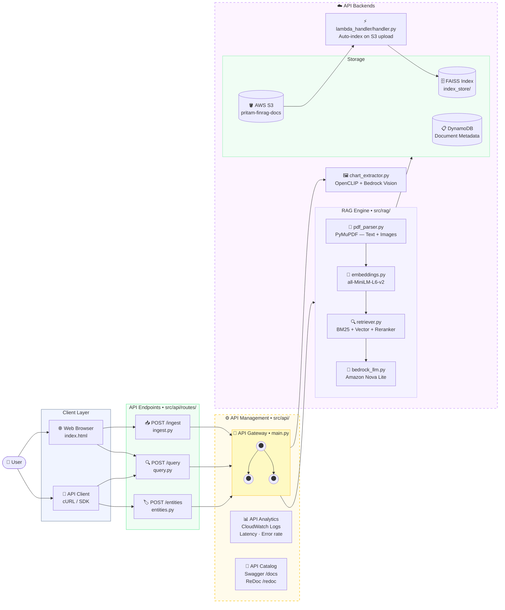

<div align="center">

# 🧠 Multimodal Financial RAG

### Turn any financial PDF into instant, cited answers — including charts and graphs.

[](http://finrag.44.206.217.242.nip.io)
[](http://13.222.137.204:8000)

[](https://github.com/pritmon/multimodal-finrag)
[](https://python.org)
[](https://fastapi.tiangolo.com)
[](https://aws.amazon.com/bedrock/)
[](https://docker.com)
[](LICENSE)

</div>

---

## 🎯 The Problem

Financial analysts spend **days** reading 200-page annual reports, 10-Ks, and earnings releases.

**This system does it in 3 seconds.**

Upload any financial PDF. Ask a question. Get a precise answer — with the exact page number cited — in under 5 seconds.

> *"What was Apple's gross margin in Q3 2023?"*
> → **"Apple's gross margin was 44.5% in Q3 2023, an improvement from 43.3% in the prior year. [Source 1, Page 42]"**

It doesn't guess. It only answers from what's in your document — **text AND charts**.

---

## 🌟 What Makes It Different

Most RAG systems only read text. **This one reads both:**

| Input Type | What Happens |
|---|---|
| 📄 **Text paragraphs** | PyMuPDF extracts and chunks them → embedded → indexed |
| 🖼️ **Charts & Graphs** | CLIP detects them → Bedrock Nova describes them → caption is indexed |

So when you ask *"What was the revenue trend?"*, the system finds the bar chart on that page, sends it to the AI as an image, and explains it alongside the text.

---

## 🏗️ Architecture



---

## 🗺️ How It Was Built — The Full Journey

### The Big Picture

Think of this like a **smart librarian** with 5 superpowers:

```
You ask a question
       ↓
Librarian searches thousands of paragraphs   (BM25 + Vector Search)
       ↓
Librarian picks the best 4 paragraphs        (Cross-Encoder Reranker)
       ↓
Librarian also looks at relevant charts      (CLIP + Bedrock Vision)
       ↓
Librarian writes a precise answer            (Nova Lite LLM)
       ↓
You get: Answer + Page Numbers + Chart Images
```

---

### Chapter 1 — Reading the PDF
**File:** `src/ingestion/pdf_parser.py`

PDFs are not plain text — they're a complex binary format. I used **PyMuPDF (fitz)**, the fastest Python PDF library, to extract everything.

```
PDF File
   ↓  pdf_parser.py → PDFParser.parse_bytes()
fitz.open()
   ↓
For each page:
   _extract_text_blocks() → 800 TextBlock objects
        Each block = one paragraph + page number + position
        Heading detection: font 30% bigger than median = is_heading=True
   _extract_images()      → 45 EmbeddedImage objects
        Tiny images (< 50×50 px) are skipped automatically
   ↓
Returns: ParsedDocument (all pages, all blocks, all images)
```

---

### Chapter 2 — Turning Text into Numbers (Embeddings)
**File:** `src/rag/embeddings.py`

How do you search by *meaning*, not just keywords?

*"What was the profit?"* and *"How much did they earn?"* mean the same thing but share zero words. **Embeddings** solve this — they convert text into 384 numbers that capture meaning.

```
"What was the profit?"    → [0.12, -0.45, 0.78, ...]
"How much did they earn?" → [0.11, -0.44, 0.79, ...]  ← nearly identical!
"The sky is blue."        → [-0.92, 0.23, -0.11, ...]  ← totally different
```

| Option | Speed | Cost |
|---|---|---|
| Bedrock Titan Embeddings | 4+ hours for 800 chunks (throttled at 5 req/sec) | Paid API |
| `all-MiniLM-L6-v2` (local) | **3 seconds** for 800 chunks | **Free** |

The local model runs on the machine — no internet, no API calls, no throttling. **5,000× faster.**

---

### Chapter 3 — Building the Search Index
**File:** `src/rag/pipeline.py`

Two indexes are built in parallel:

**FAISS Vector Index** (semantic search)
Stores all 384-dimensional vectors. Finds the nearest vectors using mathematical distance — like finding geographically close points on a map.

**BM25 Keyword Index** (exact search)
The algorithm behind original Google Search. Scores documents by keyword frequency, adjusted for document length.

| Search Type | Finds | Example |
|---|---|---|
| BM25 | Exact words | `"$2.1B"` matches `"$2.1B"` |
| Vector | Meaning | `"profit"` matches `"earnings"` |
| **Together** | **Both** | **Best results** |

---

### Chapter 4 — Chart Detection and Captioning
**File:** `src/ingestion/chart_extractor.py`

A bar chart showing "Revenue by Quarter" might contain the most important data in the document — but it's just an image with no text to search.

**Step 1 — CLIP decides "Is this a chart?"** (local, fast)

OpenCLIP scores each image against 13 descriptions simultaneously:

```
"a financial chart or graph"  ← positive
"a bar chart"                 ← positive
"a line graph"                ← positive
"a photograph"                ← negative
"a logo or icon"              ← negative
```

If combined score for chart descriptions ≥ 45% → it's a chart. No training needed — this is **zero-shot classification**.

**Step 2 — Bedrock Nova describes the chart** (cloud, detailed)

```
Input:  Chart image + prompt "Describe this financial chart..."
Output: "This is a bar chart showing quarterly revenue from Q1 2021
         to Q4 2023. Revenue grew from $89.6B to $119.6B, peaking
         in Q4 each year..."
```

This caption becomes a **searchable text chunk** — now users can ask questions about charts too.

**Speed trick:** Up to 5 chart captions run in parallel with `ThreadPoolExecutor` — 5 × 3 seconds becomes ~3 seconds total.

---

### Chapter 5 — Finding the Best Chunks (Hybrid Retrieval)
**File:** `src/rag/retriever.py`

Every query goes through 3 stages:

**Stage 1 — Two searches run in parallel**
```
Question: "What is Apple's gross margin?"
    ├── BM25Retriever.retrieve()    → top 10 keyword-matching chunks
    └── VectorIndexRetriever        → top 10 semantically similar chunks
```

**Stage 2 — Reciprocal Rank Fusion merges both lists**
```
RRF Score = 1/(60 + rank_in_bm25) + 1/(60 + rank_in_vector)
```
A chunk that ranks #1 in both lists scores much higher than one ranked #1 in only one list. This rewards consistency.

**Stage 3 — Cross-Encoder picks the best 4**

The cross-encoder reads the **question and each passage together** — understanding their relationship far better than vector similarity alone.

```
Input:  "Question: What is Apple's gross margin?
         Passage: Apple reported gross margin of 44.5% in Q3..."
Output: Confidence score: 0.94  ✓ Very relevant

Input:  "Question: What is Apple's gross margin?
         Passage: Apple employs 164,000 people worldwide..."
Output: Confidence score: 0.08  ✗ Not relevant
```

Result: **4 highly precise chunks** — the perfect context for the LLM.

---

### Chapter 6 — Generating the Answer
**File:** `src/rag/bedrock_llm.py` → `src/rag/pipeline.py`

The 4 best chunks + chart captions are assembled into a prompt:

```
Context:
[Source 1] Apple's gross margin was 44.5% in Q3 2023...
[Source 2] Operating margin reached 29.2%...
[Chart]    Bar chart showing quarterly margins from 2021–2023...

Question: What is Apple's gross margin?

Answer:
```

Amazon Nova Lite reads this and writes:
> *"Apple's gross margin was 44.5% in Q3 2023 [Source 1], showing an improvement from 43.3% in the prior year..."*

**Why Nova Lite and not Claude?**
Claude requires payment verification on AWS free tier. Nova Lite works immediately — no approval needed.

---

### Chapter 7 — The Web API
**Files:** `src/api/main.py`, `src/api/routes/`, `src/api/schemas.py`

Everything is wrapped in a FastAPI web server:

```
POST /ingest   →  Upload PDF → S3 → Background indexing → Returns job_id immediately
GET  /ingest/status/{job_id}  →  Poll until "done"
POST /query    →  Ask question → Returns answer + citations + charts
POST /entities →  Extract ORG, MONEY, DATE, PERCENT from text
GET  /health   →  Is the service alive? Is the index loaded?
```

**Async trick for uploads:** Indexing takes 10–30 seconds. Instead of making users wait:
1. PDF saved to S3 immediately (~1 second)
2. HTTP 202 returned instantly with a `job_id`
3. Background thread does the actual indexing
4. User polls `/status/{job_id}` until `"status": "done"`

---

### Chapter 8 — Financial NER (Bonus Feature)
**Files:** `src/finetune/dataset.py`, `src/finetune/lora_trainer.py`, `src/finetune/inference.py`

A BERT model fine-tuned to automatically find financial terms in text:

| Input | Detected Entities |
|---|---|
| *"Goldman Sachs earned $12.6B in Q3 2023"* | Goldman Sachs → **ORG**, $12.6B → **MONEY**, Q3 2023 → **DATE** |
| *"Revenue grew 15% year-over-year"* | 15% → **PERCENT** |

Fine-tuned with **LoRA** — trains only ~1% of model parameters instead of all 110M. 20 minutes instead of 4+ hours.

---

### Chapter 9 — Packaging and Deployment
**Files:** `Dockerfile`, `k8s/`, `.github/workflows/`

**Docker multi-stage build:**
```
Stage 1 (Builder): Install all Python packages  (~3 GB)
Stage 2 (Runtime): Copy only what's needed      (~800 MB)
```
75% smaller image → faster deployments, lower costs.

**Two live deployments:**

| Platform | Technology | Purpose |
|---|---|---|
| AWS EKS | Kubernetes + HPA + Ingress | Production — auto-scales with traffic |
| AWS ECS | Fargate containers | Simple demo deployment |

**CI/CD pipeline:**
```
Every git push to main:
    ↓  .github/workflows/ci.yml
    pytest tests/
    ↓
Green ✅ = safe to deploy
Red ❌  = blocked — broken code cannot reach production

Manual deploy (workflow_dispatch only):
    ↓  .github/workflows/deploy.yml
    Docker build → ECR push → kubectl rollout
```

---

## 📁 Full Project Map (with File Roles)

```
multimodal-finrag/
│
├── src/
│   ├── config.py                    ← All settings (AWS, model IDs, paths)
│   │                                   Override via .env or environment variables
│   │
│   ├── ingestion/
│   │   ├── pdf_parser.py            ← Step 1: Read PDF → TextBlocks + Images
│   │   ├── chart_extractor.py       ← Step 2: CLIP chart detection + Nova caption
│   │   └── s3_loader.py             ← Upload/download PDFs from AWS S3
│   │
│   ├── rag/
│   │   ├── embeddings.py            ← Step 3: Text → 384-dim vectors (local, free)
│   │   ├── retriever.py             ← Step 4: BM25 + Vector + RRF + Reranker
│   │   ├── bedrock_llm.py           ← Step 5: Call Amazon Nova Lite via Bedrock
│   │   └── pipeline.py              ← MASTER: Orchestrates all steps above
│   │
│   ├── api/
│   │   ├── main.py                  ← FastAPI app factory + startup/shutdown
│   │   ├── schemas.py               ← Request/Response shapes (Pydantic v2)
│   │   └── routes/
│   │       ├── ingest.py            ← POST /ingest  (async background indexing)
│   │       ├── query.py             ← POST /query   (RAG query endpoint)
│   │       └── entities.py          ← POST /entities (financial NER)
│   │
│   ├── finetune/
│   │   ├── dataset.py               ← Synthetic NER training data generator
│   │   ├── lora_trainer.py          ← Fine-tune BERT with LoRA adapters
│   │   └── inference.py             ← Run NER model → ORG/MONEY/DATE/PERCENT
│   │
│   └── lambda_handler/
│       └── handler.py               ← AWS Lambda: auto-index when PDF lands in S3
│
├── k8s/
│   ├── deployment.yaml              ← Kubernetes Deployment (replicas, resources)
│   ├── service.yaml                 ← Kubernetes Service (load balancer)
│   ├── hpa.yaml                     ← Horizontal Pod Autoscaler (auto-scaling)
│   └── ingress.yaml                 ← Ingress (domain routing)
│
├── tests/
│   └── test_pdf_parser.py           ← pytest suite (runs on every CI push)
│
├── .github/workflows/
│   ├── ci.yml                       ← Auto-test on every push to main
│   └── deploy.yml                   ← Manual deploy: Docker → ECR → EKS
│
├── Dockerfile                       ← Multi-stage build (3GB → 800MB)
├── pyproject.toml                   ← Python project config + asyncio_mode=strict
└── CLAUDE.md                        ← Engineering notes and project rules
```

---

## ⚡ The 3 Decisions That Made the Biggest Difference

| Decision | What I Did | Why It Mattered |
|---|---|---|
| **Local embeddings** | `all-MiniLM-L6-v2` instead of Bedrock Titan | 5,000× faster — 3 seconds vs 4+ hours |
| **Page-level chunks** | Merge all blocks per page, then split | 11,327 blocks → 800 clean chunks — indexing from 4 hours to 41 seconds |
| **Hybrid search** | BM25 + Vector + Cross-encoder | Neither alone is enough. Together they cover each other's blind spots |

---

## 🚀 Quick Start (Local)

### 1. Clone and install

```bash
git clone https://github.com/pritmon/multimodal-finrag.git
cd multimodal-finrag

python -m venv .venv && source .venv/bin/activate
pip install -r requirements.txt
```

### 2. Configure environment

```bash
cp .env.example .env
# Edit .env — add your AWS credentials
```

```env
AWS_REGION=us-east-1
AWS_ACCESS_KEY_ID=your_key
AWS_SECRET_ACCESS_KEY=your_secret
BEDROCK_MODEL_ID=amazon.nova-lite-v1:0
S3_BUCKET=your-bucket-name
```

### 3. Start the server

```bash
uvicorn src.api.main:app --host 0.0.0.0 --port 8000
```

### 4. Upload a PDF

```bash
curl -X POST http://localhost:8000/ingest \
     -F "file=@annual_report.pdf"
# → {"job_id": "abc123", "status": "indexing"}

# Poll until done
curl http://localhost:8000/ingest/status/abc123
# → {"status": "done", "text_nodes": 905, "chart_nodes": 5}
```

### 5. Ask a question

```bash
curl -X POST http://localhost:8000/query \
     -H "Content-Type: application/json" \
     -d '{"question": "What was the operating margin in FY2025 vs FY2024?"}'
```

### 6. Extract financial entities

```bash
curl -X POST http://localhost:8000/entities \
     -H "Content-Type: application/json" \
     -d '{"text": "Goldman Sachs reported $12.6B revenue in Q3 2023, up 15% year-over-year."}'
```

---

## 🔌 API Reference

| Endpoint | Method | Description |
|---|---|---|
| `/` | GET | Built-in UI |
| `/health` | GET | Health check + index status |
| `/ingest` | POST | Upload PDF (returns job_id instantly) |
| `/ingest/status/{job_id}` | GET | Poll indexing progress |
| `/query` | POST | Ask a question — returns answer + citations + charts |
| `/entities` | POST | Extract ORG / MONEY / DATE / PERCENT |
| `/docs` | GET | Swagger interactive API docs |

**Sample `/query` response:**
```json
{
  "answer": "Operating margin improved from 20.7% (FY2024) to 21.1% (FY2025). [Source 2]",
  "query": "What was the operating margin?",
  "model_id": "amazon.nova-lite-v1:0",
  "sources": [
    {
      "text": "...operating margin of 21.1% for the full year...",
      "score": 0.9412,
      "page_number": 42,
      "source": "annual_report.pdf"
    }
  ],
  "charts": [
    {
      "caption": "Bar chart showing annual operating margin from FY2020 to FY2025...",
      "page_number": 15,
      "chart_type": "a bar chart",
      "clip_score": 0.7823
    }
  ],
  "latency_ms": 2341.5
}
```

---

## 📊 Performance

| Metric | Value |
|---|---|
| 369-page PDF — full indexing | ~41 seconds |
| 800 chunks — embedding time | ~3 seconds (local, free) |
| Charts captioned per document | up to 5 (parallel) |
| Query latency (end to end) | ~3–4 seconds |
| Docker image size | ~800 MB (multi-stage build) |

---

## 🛠️ Tech Stack

| Layer | Technology | File |
|---|---|---|
| **PDF Parsing** | PyMuPDF (fitz) | `src/ingestion/pdf_parser.py` |
| **Chart Detection** | OpenCLIP ViT-B-32 (zero-shot) | `src/ingestion/chart_extractor.py` |
| **Chart Captioning** | Amazon Nova Lite Vision | `src/ingestion/chart_extractor.py` |
| **Embeddings** | all-MiniLM-L6-v2 (local) | `src/rag/embeddings.py` |
| **Keyword Search** | BM25 (rank-bm25) | `src/rag/retriever.py` |
| **Vector Search** | FAISS via LlamaIndex | `src/rag/retriever.py` |
| **Score Fusion** | Reciprocal Rank Fusion | `src/rag/retriever.py` |
| **Reranker** | cross-encoder/ms-marco-MiniLM | `src/rag/retriever.py` |
| **LLM** | Amazon Nova Lite (Bedrock) | `src/rag/bedrock_llm.py` |
| **RAG Orchestration** | LlamaIndex 0.10+ | `src/rag/pipeline.py` |
| **API** | FastAPI + Uvicorn | `src/api/main.py` |
| **Validation** | Pydantic v2 | `src/api/schemas.py` |
| **NER Fine-tuning** | LoRA + PEFT on BERT | `src/finetune/lora_trainer.py` |
| **Cloud Storage** | AWS S3 | `src/ingestion/s3_loader.py` |
| **Lambda Trigger** | AWS Lambda | `src/lambda_handler/handler.py` |
| **Container** | Docker multi-stage | `Dockerfile` |
| **Orchestration** | AWS EKS (Kubernetes) | `k8s/` |
| **CI/CD** | GitHub Actions | `.github/workflows/` |

---

## ☁️ AWS Configuration

| Setting | Value |
|---|---|
| **Account ID** | `020262236277` |
| **Region** | `us-east-1` |
| **EKS Cluster** | `finrag-cluster-eks` |
| **ECS Cluster** | `finrag-cluster` |
| **S3 Bucket** | `pritam-finrag-docs` |
| **IAM Role** | `finrag-task-execution-role` |
| **ECR** | `020262236277.dkr.ecr.us-east-1.amazonaws.com/finrag-api` |

### Minimum IAM Permissions

```json
{
  "Version": "2012-10-17",
  "Statement": [
    {
      "Effect": "Allow",
      "Action": ["bedrock:InvokeModel", "bedrock:InvokeModelWithResponseStream"],
      "Resource": [
        "arn:aws:bedrock:*::foundation-model/amazon.nova-lite-v1:0",
        "arn:aws:bedrock:*::foundation-model/anthropic.claude-3-*"
      ]
    },
    {
      "Effect": "Allow",
      "Action": ["s3:GetObject", "s3:PutObject", "s3:ListBucket"],
      "Resource": "*"
    }
  ]
}
```

Enable in AWS Console → Bedrock → Model Access → **Amazon Nova Lite**

---

## ⚙️ Configuration Reference

| Variable | Default | Description |
|---|---|---|
| `AWS_REGION` | `us-east-1` | AWS region for all services |
| `BEDROCK_MODEL_ID` | `amazon.nova-lite-v1:0` | LLM model for generation |
| `S3_BUCKET` | `finrag-documents` | PDF storage bucket |
| `INDEX_PERSIST_DIR` | `./index_store` | Vector index save path |
| `LORA_MODEL_PATH` | `./models/finrag-ner-lora` | NER adapter path |
| `RETRIEVER_TOP_K` | `8` | Chunks retrieved per query |
| `RERANKER_TOP_N` | `4` | Chunks after reranking |
| `CHUNK_SIZE` | `512` | Token chunk size |
| `CHUNK_OVERLAP` | `64` | Token overlap between chunks |

---

## 🧪 Running Tests

```bash
pytest                    # run all tests
pytest -v                 # verbose output
pytest --cov=src          # with coverage report
```

---

## 🌐 Live Deployments

<div align="center">

| Platform | URL | Status |
|---|---|---|
| **AWS EKS** (Kubernetes) | http://finrag.44.206.217.242.nip.io | 🟢 Live |
| **AWS ECS** (Fargate) | http://13.222.137.204:8000 | 🟢 Live |

---

Built by **Pritam Mondal** — MIT License

</div>
